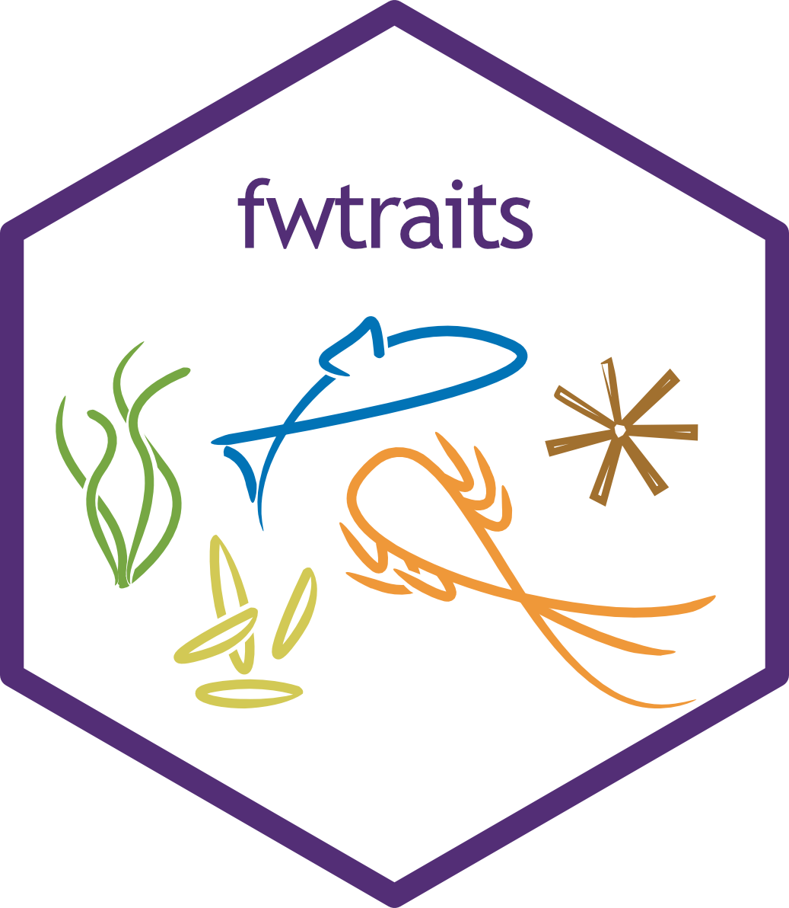
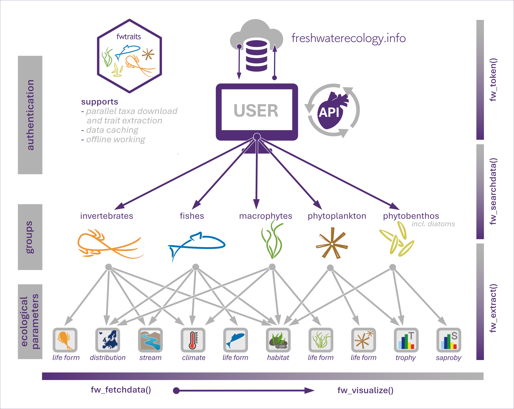

<!-- README.md is generated from README.Rmd. Please edit that file -->

```{r, include = FALSE}
knitr::opts_chunk$set(
  collapse = TRUE,
  comment = "#>",
  fig.path = "man/figures/README-",
  out.width = "100%"
)
```

### fwtraits for retrieving from www.freshwaterecology.info database

<!-- badges: start -->
[](http://www.gnu.org/licenses/gpl-3.0.html)
[](https://github.com/AnthonyBasooma/fwtraits/actions/workflows/R-CMD-check.yaml)
[](https://codecov.io/gh/AnthonyBasooma/fwtraits)
[](https://github.com/AnthonyBasooma/fwtraits/repo/releases)

<!-- badges: end -->



### Aim of the package

**fwtraits** provides a seamless and robust access to the species ecological parameters, traits, or indicators from the **www.freshwaterecology.info database** (Schmidt-Kloiber & Hering 2015). The database hosts an array of ecological parameters for different taxonomic groups, including fish, macroinvertebrates, phytoplankton, diatoms, and phytobenthos. Experts periodically review the data to ensure quality. The data is used in ecological studies, primarily for functional diversity or macroecological analyses.

**NOTE**

* To seamlessly access the databases, an API has been developed by the database hosts. Therefore, to freely access the database, the user is required to sign up and make a request for the API key. 

**Package installation**

To access the package: 

``` r
# install.packages("devtools")

if (!requireNamespace("remotes", quietly = TRUE)) install.packages("remotes")

remotes::install_github("AnthonyBasooma/fwtraits")

```
### Package usage

---
The database is arranged into organism groups including macroinvertebrates, fishes, phytoplankton, macrophytes, and phytobenthos most especially the diatoms (Figure 1). The package is a wrapper around the [fweapi2](https://www.freshwaterecology.info/fweapi2docu.php) developed and maintained by the University of Natural Resources and Life Sciences (BOKU), Vienna, Austria.

Before using the package, the user is strongly advised to run the **`fw_be4ustart()`** to get the steps required to access and use the package in accessing the species ecological parameters, traits or indicators.



### Main functions

* `fw_setapikey()` for securing API key in the user R environment.
* `fw_searchdata()` To allow get data from the database. However, this is mostly an internal function since the data is not already parsed to enable usability.
* `fw_fetchdata()` is the main function that provides all the parameters for data access. The function is wrapped around `fw_searchdata()` function to allow the user to easily get and manipulate the data during package usage.

### Other utility functions

* `check_names()` to check spellings species taxonomic names to allow the user obtain the species traits.
* `fw_checktraits()`harmonize species traits to allow effective between user inputs and database information.
* `fw_visualize()`provides graphical display of the information obtained from the database.

### Funding

The package was created with support from the AquaINFRA project which is aimed at developing data and services to support marine and freshwater scientists and stakeholders. Also, the DANUBE4All project and HR21 Doctoral School under BOKU University provided logistical support during the development of this package.


### References

Schmidt-Kloiber, A., & Hering, D. (2015). Www.freshwaterecology.info - An online tool that unifies, standardises and codifies more than 20,000 European freshwater organisms and their ecological preferences. Ecological Indicators, 53, 271-282. https://doi.org/10.1016/j.ecolind.2015.02.007
