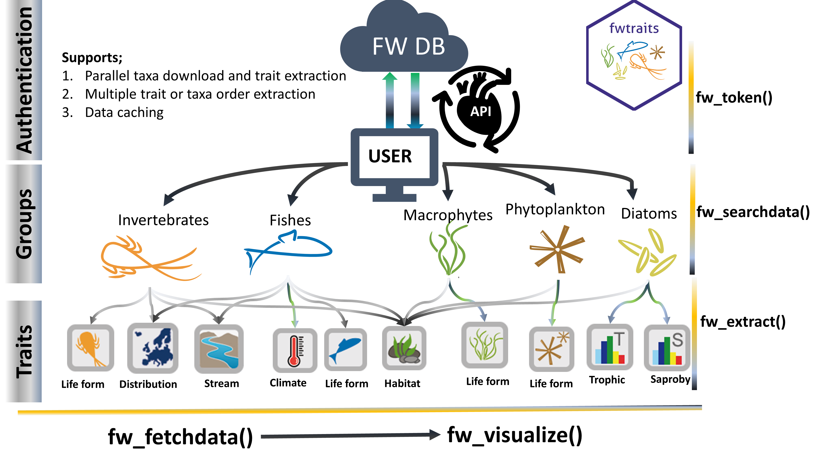

<!-- README.md is generated from README.Rmd. Please edit that file -->

# fwtraits

<!-- badges: start -->

[](https://github.com/AnthonyBasooma/fwtraits/actions/workflows/R-CMD-check.yaml)
[](https://codecov.io/gh/AnthonyBasooma/fwtraits)

<!-- badges: end -->

**Aim of the package**

**fwtraits** provides a seamless and robust access to the species
ecological parameters, traits or indicators from the
**www.freshwaterecology.info database** (Schmidt-Kloiber & Hering 2015).

**Package installation**

The package is currently accessible of GitHub

``` r
# install.packages("devtools")

if (!requireNamespace("remotes", quietly = TRUE)) install.packages("remotes")

remotes::install_github("AnthonyBasooma/fwtraits")
```

**Package usage**

------------------------------------------------------------------------

The database is arranged into organism groups including
macroinvertebrates, fishes, phytoplankton, macrophytes, and phytobenthos
most especially the diatoms (Figure 1). The package is a wrapper around
the [fweapi2](https://www.freshwaterecology.info/fweapi2docu.php)
developed and maintained by the University of Natural Resources and Life
Sciences (BOKU), Vienna, Austria.

Before using the package, the user is strongly advised to run the
**`fw_be4ustart()`** to get the steps required to access and use the
package in accessing the species ecological parameters, traits or
indicators.

<!--  -->

**Main functions**

- `fw_setapikey()` for securing API key in the user R environment.
- `fw_searchdata()` To allow get data from the database. However, this
  is mostly an internal function since the data is not already parsed to
  enable usability.
- `fw_split()` extracts the downloaded data before its tokenised for
  proper usage.
- `fw_fetchdata()` is the main function that provides all the parameters
  for data access. The function is wrapped around `fw_searchdata()` and
  `fw_split()` function to allow the user to easily get and manipulate
  the data during package usage.

**Other utility functions**

- `fw_check_names()` to check spellings species taxonomic names to allow
  the user obtain the species traits.
- `fw_checktraits()`harmonize species traits to allow effective between
  user inputs and database information.
- `fw_visualize()`provides graphical display of the information obtained
  from the database.

**Funding**

The package was created with support from the AquaINFRA project which is
aimed at developing data and services to support marine and freshwater
scientists and stakeholders. Also, the DANUBE4All project and HR21
Doctoral School under BOKU University provided logistical support during
the development of this package.

**References**

Schmidt-Kloiber, A., & Hering, D. (2015). Www.freshwaterecology.info -
An online tool that unifies, standardises and codifies more than 20,000
European freshwater organisms and their ecological preferences.
Ecological Indicators, 53, 271-282.
<https://doi.org/10.1016/j.ecolind.2015.02.007>
