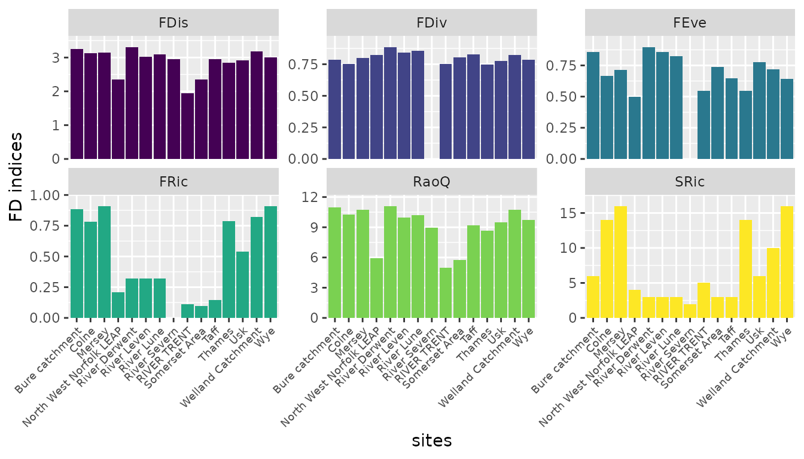
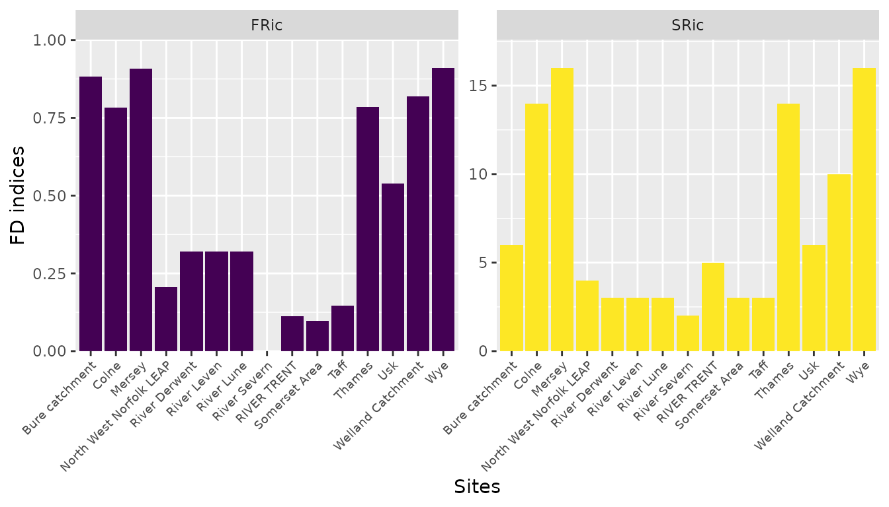

# Computing functional diversity indices and community weighted means for fishes.

The **fwtraits** access the www.freshwaterecology.info database that
contains several ecological parameters, traits, and indicators used in
biogeographical modeling, functional diversity and taxonomic
assessments, and environmental monitoring. These are grouped based on
the taxonomic groups, including macroinvertebrates, fishes,
phytoplankton, phytobenthos, and macrophytes. Therefore, in this
workflow, we demonstrated using ecological parameters from the database
in assessing functional diversity.

``` r
library(fwtraits)
library(ggplot2)
```

### Fishes data used in the analysis

We tested using the species data with both spatial coordinates to
auto-generate sites or sites already indicated in the sites or species
data.

``` r
data("speciesdata")

set.seed(1135)
speciesdata$abund <- rnorm(n = nrow(speciesdata), 4.3, 1.2)

#species with geographical coordinates

geospdata <- speciesdata |> 
  sf::st_as_sf(coords = c('decimalLongitude', 'decimalLatitude'), 
               crs = sf::st_crs(4326))
```

### Retrieving the ecological parameters from the database

We considered two ecological references for fishes: rheophily habitat,
spawning habitat, and feeding diet adult. These were selected because
most species have records, reducing missing values that might have
required imputation.

It should be noted that imputing for missing traits is outside the scope
of this package. So, species that do not have records were dropped when
computing the functional diversity indices or community weighted means.

``` r

fishtraits <- fw_fetchdata(data = speciesdata, 
                         ecoparams = c('rheophily habitat', 'spawning habitat',
                                       'feeding diet adult'), 
                         taxonomic_column = 'scientificName',
                         organismgroup = 'fi')
```

#### 1. Compute functional diversity indices

These are computed by setting **`FD to TRUE`** and **abund** parameter
must be provided. They the indices are computed using the **`FD`**
package (Laliberté & Legendre 2010). The indices tested included
Functional richness (FRic), species richness (SRic), Functional evenness
(FEve), Functional diversity (FDiv), Functional dispersion (FDis), and
Rao quotient (Rao Q).

``` r

#fd indices calculated when abundance  is provided.

fdindices <- fw_fdcompute(fwdata = fishtraits, 
                        sitesdata = speciesdata,
                        sites = 'waterBody',
                        species = 'scientificName',
                        abund = 'abund',
                        FD = TRUE)
head(fdindices, 3)
#>     site      FRic SRic      FEve      FDiv     FDis      RaoQ
#> 1  Colne 0.7837022   14 0.6666667 0.7514879 3.130064 10.274519
#> 2 Mersey 0.9073171   16 0.7142857 0.7992736 3.148708 10.713105
#> 3 Thames 0.7852545   14 0.5471074 0.7493893 2.843325  8.656933

#functional richness only: when abundance is not provided.
fdric<- fw_fdcompute(fwdata = fishtraits, 
                        sitesdata = speciesdata,
                        sites = 'waterBody',
                        species = 'scientificName',
                        FD = TRUE)
head(fdric, 3)
#>         site      FRic SRic
#> 1        Usk 0.5381900    6
#> 2       Taff 0.1459965    3
#> 3 River Lune 0.3203472    3
```

#### 2. Compute Functional Diversity indices using autogenerated sites.

``` r

#fd indices calculated when abundance  is provided.

geofdind <- fw_fdcompute(fwdata = fishtraits, 
                        sitesdata = geospdata,
                        species = 'scientificName',
                        abund = 'abund',
                        FD = TRUE)
head(geofdind, 3)
#>    site      FRic SRic      FEve      FDiv     FDis      RaoQ
#> 1 99116 0.7837022   14 0.6658334 0.7486573 3.146454 10.355734
#> 2 99172 0.7828410   12 0.6645772 0.7600437 2.927213  9.374808
#> 3 99260 0.7852545   12 0.6256742 0.7396812 2.880293  8.890285

#functional richness only: when abundance is not provided.
geofd <- fw_fdcompute(fwdata = fishtraits, 
                        sitesdata = geospdata,
                        species = 'scientificName',
                        FD = TRUE)
head(geofd, 3)
#>   site      FRic SRic
#> 1  991        NA    2
#> 2  993        NA    1
#> 3  994 0.1459965    3
```

#### 3. Visualisation of the ecological paramter for each index.

``` r

df <- fdindices |> tidyr::gather('fdind', "vals", -site)
                                 
ggplot(data = df, aes(site, vals, fill = fdind))+
  geom_bar(stat = 'identity')+
  scale_fill_viridis_d()+
  theme(legend.position = "none",
        axis.text.x = element_text(angle = 45, hjust = 1, size = 7))+
  facet_wrap(~fdind, scales ='free_y')+
  scale_y_continuous(expand = expansion(mult = c(0, 0.1)))+
  labs(x='sites', y='FD indices')
```



``` r

#Functional richness

dffric <- fdric |> tidyr::gather('fdind', "vals", -site)
                                 
ggplot(data = dffric, aes(site, vals, fill = fdind))+
  geom_bar(stat = 'identity')+
  scale_fill_viridis_d()+
  theme(legend.position = "none",
        axis.text.x = element_text(angle = 45, hjust = 1, size = 7))+
  facet_wrap(~fdind, scales ='free_y')+
  scale_y_continuous(expand = expansion(mult = c(0, 0.1)))+
  labs(x='Sites', y='FD indices')
```



#### 4. Compute community weighted means.

Community weighted means measures how traits vary with environmental
change (Guy-Haim & Bouchet 2025).

``` r
cwmdata <- fw_fdcompute(fwdata = fishtraits, 
                        sitesdata = speciesdata,
                        sites = 'waterBody',
                        species = 'scientificName',
                        abund = 'abund',
                        FD = FALSE)
head(cwmdata, 3)
#>     site X.rheophily.habitat.eurytopic X.rheophily.habitat.limnophilic
#> 1  Colne                     0.4598488                      0.12751814
#> 2 Mersey                     0.3665371                      0.05518399
#> 3 Thames                     0.4602653                      0.03823995
#>   X.rheophily.habitat.rheophilic X.rheophily.habitat.rheophilic.A
#> 1                              0                        0.3424712
#> 2                              0                        0.5095482
#> 3                              0                        0.4475848
#>   X.rheophily.habitat.rheophilic.B X.spawning.habitat.euryoparous
#> 1                       0.07016187                      0.4440039
#> 2                       0.06873071                      0.2894240
#> 3                       0.05390994                      0.2242217
#>   X.spawning.habitat.limnoparous X.spawning.habitat.rheoparous
#> 1                      0.2029570                     0.3530391
#> 2                      0.2081951                     0.5023809
#> 3                      0.2596240                     0.5161543
#>   X.feeding.diet.adult.detritivorous X.feeding.diet.adult.invertivorous
#> 1                         0.00000000                          0.3449768
#> 2                         0.06693826                          0.3845350
#> 3                         0.00000000                          0.2437924
#>   X.feeding.diet.adult.omnivorous X.feeding.diet.adult.piscivorous
#> 1                       0.5043557                        0.1506675
#> 2                       0.4272511                        0.1212756
#> 3                       0.6405770                        0.1156306
```

#### 5. Compute community weighted means using raw traits.

In this approach, this does not require fuzzy coding of the trait data.
This is necessary for community weighted means.

``` r
cwmdata2 <- fw_fdcompute(fwdata = fishtraits, 
                        sitesdata = speciesdata,
                        sites = 'waterBody',
                        species = 'scientificName',
                        abund = 'abund',
                        FD = FALSE, dummy = FALSE)
head(cwmdata2, 3)
#>     site rheophily.habitat_eurytopic rheophily.habitat_limnophilic
#> 1  Colne                   0.4598488                    0.12751814
#> 2 Mersey                   0.3665371                    0.05518399
#> 3 Thames                   0.4602653                    0.03823995
#>   rheophily.habitat_rheophilic rheophily.habitat_rheophilic.A
#> 1                            0                      0.3424712
#> 2                            0                      0.5095482
#> 3                            0                      0.4475848
#>   rheophily.habitat_rheophilic.B spawning.habitat_euryoparous
#> 1                     0.07016187                    0.4440039
#> 2                     0.06873071                    0.2894240
#> 3                     0.05390994                    0.2242217
#>   spawning.habitat_limnoparous spawning.habitat_rheoparous
#> 1                    0.2029570                   0.3530391
#> 2                    0.2081951                   0.5023809
#> 3                    0.2596240                   0.5161543
#>   feeding.diet.adult_detritivorous feeding.diet.adult_invertivorous
#> 1                       0.00000000                        0.3449768
#> 2                       0.06693826                        0.3845350
#> 3                       0.00000000                        0.2437924
#>   feeding.diet.adult_omnivorous feeding.diet.adult_piscivorous
#> 1                     0.5043557                      0.1506675
#> 2                     0.4272511                      0.1212756
#> 3                     0.6405770                      0.1156306
```

### Refereences

1.  Laliberté, E., & Legendre, P. (2010). A distance‐based framework for
    measuring functional diversity from multiple traits. Ecology, 91(1),
    299-305.

2.  Guy-Haim, T., & Bouchet, V. M. (2025). Beyond taxonomy: A framework
    for biological trait analysis to assess the functional structure of
    benthic foraminiferal communities. Marine Pollution Bulletin, 213,
    117699.
