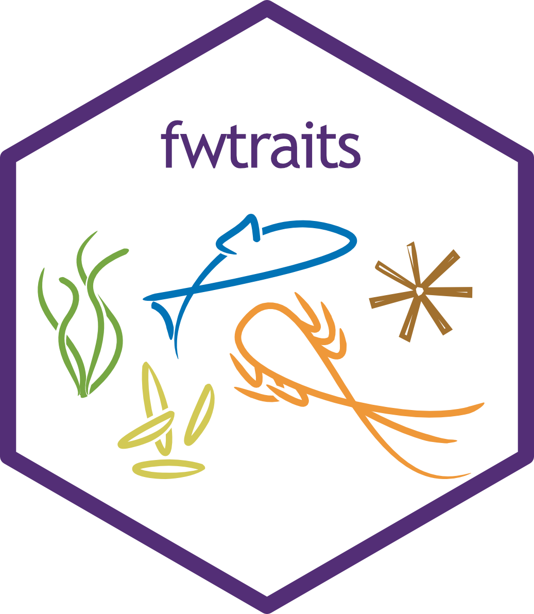

### fwtraits for retrieving from www.freshwaterecology.info database



### Aim of the package

**fwtraits** provides a seamless and robust access to the species
ecological parameters, traits, or indicators from the
**www.freshwaterecology.info database** (Schmidt-Kloiber & Hering 2015).
The database hosts an array of ecological parameters for different
taxonomic groups, including fish, macroinvertebrates, phytoplankton,
diatoms, and phytobenthos. Experts periodically review the data to
ensure quality. The data is used in ecological studies, primarily for
functional diversity or macroecological analyses.

**NOTE**

- To seamlessly access the databases, an API has been developed by the
  database hosts. Therefore, to freely access the database, the user is
  required to sign up and make a request for the API key.

**Package installation**

To access the package:

``` r
# install.packages("devtools")

if (!requireNamespace("remotes", quietly = TRUE)) install.packages("remotes")

remotes::install_github("AnthonyBasooma/fwtraits")

#To access the package vignettes in RStudio using vignettes function.
remotes::install_github("AnthonyBasooma/fwtraits", build_vignettes = TRUE, dependencies = TRUE)
```

### Package usage

------------------------------------------------------------------------

The database is arranged into organism groups including
macroinvertebrates, fishes, phytoplankton, macrophytes, and phytobenthos
most especially the diatoms (Figure 1). The package is a wrapper around
the [fweapi2](https://www.freshwaterecology.info/fweapi2docu.php)
developed and maintained by the University of Natural Resources and Life
Sciences (BOKU), Vienna, Austria.

Before using the package, the user is strongly advised to run the
**[`fw_be4ustart()`](https://anthonybasooma.github.io/fwtraits/reference/fw_be4ustart.md)**
to get the steps required to access and use the package in accessing the
species ecological parameters, traits or indicators.


**Figure 1. Accessing the species traits or ecological parameters from
the Freshwaterecology.info database (FW DB).**

### Main functions

- [`fw_setapikey()`](https://anthonybasooma.github.io/fwtraits/reference/fw_setapikey.md)
  for securing API key in the user R environment.
- [`fw_searchdata()`](https://anthonybasooma.github.io/fwtraits/reference/fw_searchdata.md)
  To allow get data from the database. However, this is mostly an
  internal function since the data is not already parsed to enable
  usability.
- [`fw_fetchdata()`](https://anthonybasooma.github.io/fwtraits/reference/fw_fetchdata.md)
  is the main function that provides all the parameters for data access.
  The function is wrapped around
  [`fw_searchdata()`](https://anthonybasooma.github.io/fwtraits/reference/fw_searchdata.md)
  function to allow the user to easily get and manipulate the data
  during package usage.

### Funding

The package was created with support from the AquaINFRA project which is
aimed at developing data and services to support marine and freshwater
scientists and stakeholders. Also, the DANUBE4All project and HR21
Doctoral School under BOKU University provided logistical support during
the development of this package.

### Package citation

Basooma, A., Borgwardt, F., Domisch, S., Buurman, M., Bremerich, V.,
Recinos Brizuela, S., Tschikof, M., Hein, T., & Schmidt-Kloiber, A.
(2025). Introducing fwtraits – an R package for obtaining freshwater
biodiversity trait information. Basic and Applied Ecology, 8, 81-91.
<https://doi.org/10.1016/j.baae.2025.10.010>

### Citation of the www.freshwaterecology.info paper

Schmidt-Kloiber, A., & Hering, D. (2015). Www.freshwaterecology.info -
An online tool that unifies, standardises and codifies more than 20,000
European freshwater organisms and their ecological preferences.
Ecological Indicators, 53, 271-282.
<https://doi.org/10.1016/j.ecolind.2015.02.007>

### Citation for www.freshwaterecology.info API

Freshwater Ecology Information Platform. (2025). FWE-API 2 –
Documentation of freshwaterecology.info. Retrieved November 20, 2025,
from <https://www.freshwaterecology.info/fweapi2docu.php>
